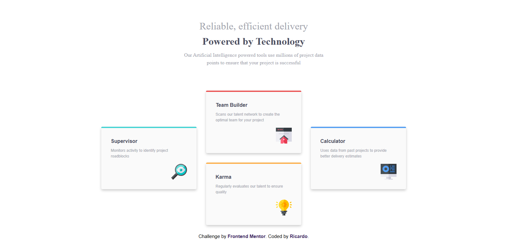

# Frontend Mentor - Four card feature section solution

This is a solution to the [Four card feature section challenge on Frontend Mentor](https://www.frontendmentor.io/challenges/four-card-feature-section-weK1eFYK). Frontend Mentor challenges help you improve your coding skills by building realistic projects. 

## Table of contents

- [Overview](#overview)
  - [The challenge](#the-challenge)
  - [Screenshot](#screenshot)
  - [Links](#links)
- [My process](#my-process)
  - [Built with](#built-with)
  - [What I learned](#what-i-learned)
  - [Continued development](#continued-development)
- [Author](#author)

## Overview

### The challenge

Users should be able to:

- View the optimal layout for the site depending on their device's screen size

### Screenshot



### Links

- Solution URL: [https://github.com/rc-0105/Four-card-feature-section](https://github.com/rc-0105/Four-card-feature-section)
- Live Site URL: [https://rc-0105.github.io/Four-card-feature-section/](https://rc-0105.github.io/Four-card-feature-section/)

## My process

### Built with

- Semantic HTML5 markup
- CSS custom properties
- Flexbox
- CSS Grid

### What I learned

I learned how to use grid areas and also how to make a layout using flexbox.

I used this kind of html section to manage multiple cards and aply a general style to card class
```html
<section class="card card-1">
    <h2>Supervisor</h2>
    <p>Monitors activity to identify project roadblocks</p>
    <div class="supervisor-icon"></div>
</section>  
```
```css
.card{
    box-shadow: 0 4px 8px rgba(0, 0, 0, 0.2);
    padding: 2em;
    background: hsl(0, 0%, 98%);
    border-radius: .25em;
    width: 100%;
    min-width: 200px;
}
```

In order to make a grid template area i had to name every card and then i do the grid.
```css
.card-1{
    border-top: 4px solid hsl(180, 62%, 55%);
    grid-area: supervisor;
}

main{
    display: grid;
    grid-template-columns: 1fr 1fr 1fr;
    grid-template-areas: 
    ". team ."
    "supervisor team calculator"
    "supervisor karma calculator"
    ". karma .";
}
```

### Continued development

In future projects ill like to organize better the css, i think that looks like a mess but ill improve it later

## Author

- Website - [Ricardo](https://github.com/rc-0105)
- Frontend Mentor - [@rc-0105](https://www.frontendmentor.io/profile/rc-0105)
